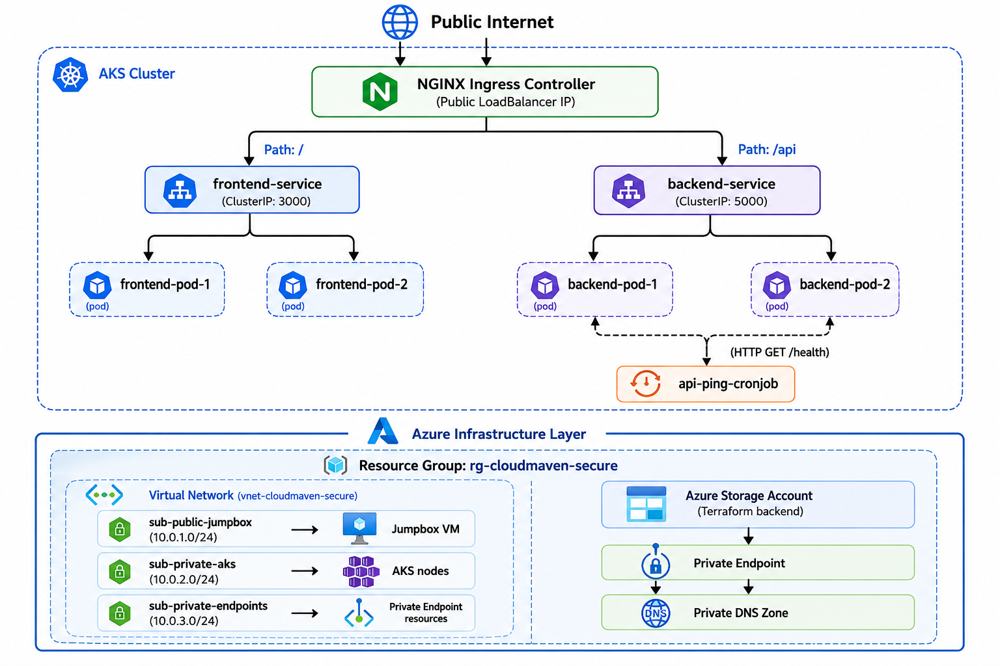

# ☁️ CloudMaven DevOps Assessment

### 2-Tier Microservice Deployment on Azure Kubernetes Service (AKS)

**Author:** Nihar Landge &nbsp;|&nbsp; **GitHub:** [@nihar-landge](https://github.com/nihar-landge) &nbsp;|&nbsp; **Assessment:** CloudMaven DevOps Intern Technical Assessment

---

## 📝 Project Overview

A secure, production-style **2-tier microservice application** deployed on **Azure Kubernetes Service (AKS)** using industry-standard DevOps tooling. The project covers end-to-end infrastructure provisioning, containerisation, Kubernetes orchestration, CI/CD automation, and observability.

| Area | Stack |
|---|---|
| Cloud | Azure (AKS · VNet · Storage Account) |
| Infrastructure as Code | Terraform (remote backend on Azure Storage) |
| Containerisation | Docker (`node:18-alpine`) |
| Orchestration | Kubernetes · Helm · NGINX Ingress |
| CI/CD | GitHub Actions |
| Observability | Prometheus · Grafana · EFK (Elasticsearch · Fluent-bit · Kibana) |

---

## 🏗️ Architecture



> The NGINX Ingress Controller receives public traffic and routes it by path — `/` to the frontend service and `/api` to the backend service. Both services run as ClusterIP, reachable only within the cluster. A CronJob pings the backend `/health` endpoint every 5 minutes to validate availability. All AKS nodes live in a private subnet; the only management entry point is a Jumpbox VM in the public subnet.

**Azure Infrastructure layout:**

```
Resource Group: rg-cloudmaven-secure
├── VNet
│   ├── sub-public-jumpbox      → Jumpbox VM + NSG
│   ├── sub-private-aks         → AKS Cluster Nodes
│   └── sub-private-endpoints   → Storage Private Endpoint
└── Terraform Remote Backend    → Azure Storage (private container)
```

---

## 📁 Repository Structure

```
devops-assessment-niharlandge/
├── terraform/
│   ├── main.tf
│   ├── variables.tf
│   ├── outputs.tf
│   ├── providers.tf
│   ├── backend.tf
│   └── modules/
│        └── networking/      # Custom VNet / Subnet / NSG module
│       
├── app/
│   ├── frontend/            # Dockerfile + server.js (port 3000)
│   └── backend/             # Dockerfile + server.js (port 5000)
├── helm/myapp/
│   ├── Chart.yaml
│   ├── values.yaml
│   └── templates/           # deployments, services, ingress, hpa,
│                            #   configmap, secret, cronjob
└── .github/workflows/
    ├── ci.yaml
    └── cd.yaml
```

---

## 🌍 1. Infrastructure Provisioning (Terraform)

| Component | Details |
|---|---|
| VNet | 3 isolated subnets |
| Jumpbox VM | `Standard_B1as_v2` · SSH restricted by NSG |
| AKS Cluster | `Standard_D2as_v4` · Azure CNI · service CIDR `172.16.0.0/16` |
| Storage Account | Private endpoint · Terraform remote backend |
| VNet Module | Clouddrove community module |
| Custom Modules | `modules/networking` + `modules/storage` |

```bash
# Set correct Azure subscription
az account set --subscription "YOUR_STUDENT_SUBSCRIPTION_ID"

# Create resource group for backend state storage
az group create --name rg-terraform-state-mgmt --location centralindia

# Create storage account and container for remote backend
az storage account create --name stdevopsassessmentstate \
  --resource-group rg-terraform-state-mgmt --location centralindia \
  --sku Standard_LRS
az storage container create --name tfstate \
  --account-name stdevopsassessmentstate

```

---

## 🔐 2. Jumpbox Setup

The AKS cluster is **fully private**. The Jumpbox is the sole management entry point into the VNet.

```bash
# Connect to the Jumpbox
ssh azureuser@<JUMPBOX_PUBLIC_IP>

# Install required tools
curl -sL https://aka.ms/InstallAzureCLIDeb | sudo bash
curl -fsSL https://raw.githubusercontent.com/helm/helm/main/scripts/get-helm-3 | bash

# Install kubectl
sudo az aks install-cli

# Authenticate and retrieve AKS credentials
az login --use-device-code

az aks get-credentials \
  --resource-group rg-cloudmaven-secure \
  --name aks-cloudmaven-cluster

# Verify access
kubectl get nodes
```

---

## 📦 3. Application Deployment (Docker + Helm)

| Service | Port | Base Image |
|---|---|---|
| Frontend | 3000 | `node:18-alpine` |
| Backend | 5000 | `node:18-alpine` |

**Kubernetes features in use:**

Deployments · ClusterIP Services · NGINX Ingress · ConfigMaps · Secrets · Resource Limits · Liveness & Readiness Probes · Rolling Updates · HPA (70 % CPU threshold · max 4 replicas) · CronJob (`*/5 * * * *`)

```bash
# Create namespaces
kubectl create namespace core-apps
kubectl create namespace ingress-basic

# Deploy via Helm
helm install cloudmaven-app ./helm/myapp --namespace core-apps

# Push updates
helm upgrade cloudmaven-app ./helm/myapp --namespace core-apps

# Force fresh image pull (avoids `latest` tag cache trap)
kubectl rollout restart deployment backend-deployment frontend-deployment \
  -n core-apps

# Install NGINX Ingress Controller
helm install ingress-nginx ingress-nginx/ingress-nginx \
  --namespace ingress-basic --create-namespace

# Watch for public IP assignment
kubectl get svc -n ingress-basic -w
```

**Local smoke test before cloud deployment:**

```bash
docker run -d --name test-api -p 5001:5000 local-backend
curl http://localhost:5001/health
```

---

## ⚙️ 4. CI/CD Pipeline (GitHub Actions)

| Job | Trigger | Steps |
|---|---|---|
| **CI** | Pull Request | Terraform validate · Docker build test · Helm lint · Upload artifacts |
| **CD** | Merge to `main` | Terraform plan + apply · Docker build + push · Helm deploy · Rollout verify · Smoke test `/health` |

```bash
# .gitignore hygiene before first push
echo "node_modules/" >> .gitignore
echo "*.tfstate*"   >> .gitignore

# Commit and trigger pipeline
git add .
git commit -m "feat: initial deployment"
git push origin main
```

---

## 🔍 6. Debugging Reference

```bash
# Access Grafana UI (Private)
kubectl port-forward svc/kube-prometheus-stack-grafana 8080:80 -n monitoring --address 0.0.0.0

# Access via Local Laptop Browser (SSH Tunnel)
ssh -L 8080:localhost:8080 azureuser@<JUMPBOX_IP>

# Access Public App via Ingress
EXTERNAL_IP=$(kubectl get svc -n ingress-basic ingress-nginx-controller -o jsonpath='{.status.loadBalancer.ingress[0].ip}')
curl http://$EXTERNAL_IP/api/health
```


---

## 🛠️ Issues Encountered & Resolutions

| # | Issue | Resolution |
|---|---|---|
| 1 | **Insufficient CPU** for Monitoring Stack | Optimized resource requests and uninstalled unused logging components on a single-node cluster. |
| 2 | **Helm Operation Lock** | Manually deleted pending Helm Secrets and used `helm rollback` to clear stale locks. |
| 3 | **Ingress path 404/Incorrect Routing** | Implemented NGINX `rewrite-target: /$2` and regex capturing groups in `ingress.yaml`. |
| 4 | **No Metrics in Grafana** | Added `ServiceMonitor` with matching port names (`http-metrics`) to enable Prometheus discovery. |
| 5 | **Terraform FMT Check Failure** | Identified incorrect indentation in `outputs.tf` via local `terraform fmt`. |
| 6 | AKS service CIDR overlapping VNet address space | Set `service_cidr = "172.16.0.0/16"` |

---

## 📋 Deliverables

| Deliverable | Status |
|---|---|
| GitHub Repository | ✅ Complete |
| Terraform Code (IaC) | ✅ Complete |
| Kubernetes Manifests (Helm) | ✅ Complete |
| Dockerfiles | ✅ Complete |
| GitHub Actions CI/CD Pipeline | ✅ Complete |
| README.md | ✅ Complete |
| Grafana Dashboard Screenshots | ✅ Complete |
| Kibana Dashboard Screenshots | ⚠️ |
---
